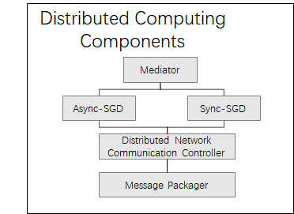
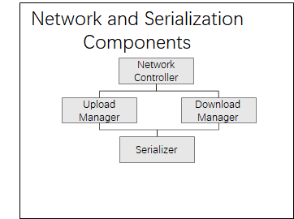
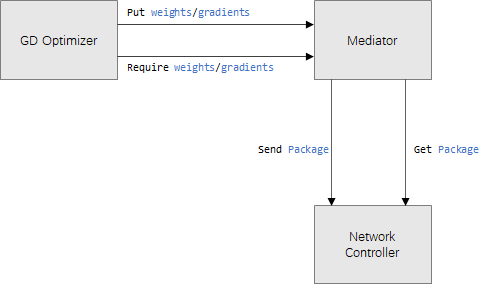

# Parallel-SGD
A platform for testing parallel stochastic gradient descent algorithm.
# Usage
## Basic usage
Run client with:
```
python client.py --ip 127.0.0.1 --port 55555
```
Run parameter server and distribution server with:
```
python init_server.py 
  --node_count 4 
  --batch_size 128 
  --redundancy 1
  --codec plain
  --psgd ssgd 
  --learn_rate 0.05 
  --epochs 10 
  --working_ports 55555
  --block_assignment iid
```
The training process will automatically started while all the clients were ready.  
## Run with script
You can also use the bash scripts to start up multiple training groups remotely.  
The scripts was writen as below, fill the parameters as needed.  
```
"$prefix": ipv4 addresss prefix. eg:192.168.1

"$ip_server": ipv4 address subnet addresss, the full address will be shown as $prefix.$ip_server. e.g.:101

"$ip_client_start": ipv4 address for first worker node. e.g.:102

"$ip_client_end": ipv4 address for the last worker node.(must be continuous sequence)  e.g.:110

"$node_started": the smallest group of training. e.g.:2

"$node_end": the largest group of training. e.g.:9,for all worker nodes between 192.168.1.102 and 192.168.1.110
```
```
echo "Start server..."
for((i=$node_start;i<=$node_end;++i)) do
    ssh default@$prefix.$ip_server "source test/venv/bin/activate; nohup python test/init_server init_server.py --node_count $i --batch_size 128 --redundancy 1 --codec ccdc --psgd ssgd --learn_rate 0.05 --epochs 10 --working_ports $((15387+$i)) > server_log_nodes$i.log 2>&1 &"
done

echo "Start all client..."
for((i=$ip_client_start;i<=$ip_client_end;i++)) do
    temp=$(($i-$ip_client_start-1))
    ssh default@$prefix.$i "source test/venv/bin/activate; nohup bash -c 'for((j=$((15387+$0));j<=$((15387+$1));++j)) python client.py --ip $prefix.$ip_server --port \$j' $temp $node_end > client_log.log 2>&1 &"
```
# Structure description
## Main

The application was divided into three components: Neural networks, Distributed computing manager and Network&serialization manager.






## Interconnections

Function call from *Mediator* to *Network Controller* is always Synchronized.  
The blocking state of function call from *GD Optimizer* to *Mediator* was defined in *Distributed Network Communication Controller*.  


